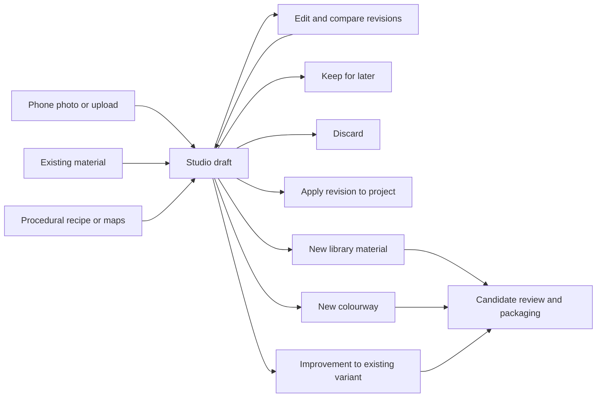
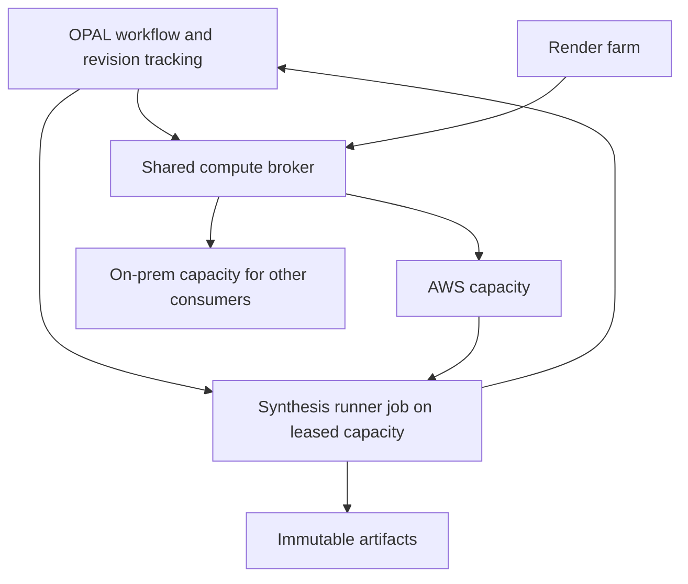

# Material synthesis, repair and Studio drafts

**Status: self-hosted R&D proof validated, 18 September 2026.** Private photo/library
drafts, immutable revisions, candidate promotion, offline RGB→X/StableDelight
inference and shared AWS dispatch are integrated. A real 1K brick-photo run
completed with cleanup and all five maps, and rendered in production Studio.
See [the measured proof](material-synthesis-proof.md) and
[the implementation runbook](../services/material-synthesis/README.md).
The broader stages below remain the product roadmap. This builds on the brief at
`~/Documents/Codex/2026-09-18/wha/outputs/material-synthesis-pipeline.md` on
Harrison's Mac and the current OPAL and Olsyn compute implementations.

## Product direction

**Required deployment model:** the complete workflow, including model inference,
must run under our control. No third-party inference APIs or external material
generation services. AWS GPU instances leased in our account remain compatible
with this requirement: we deploy our own runner images, retain model artifacts
and own the job lifecycle. Initially leave on-prem GPUs free for other workloads.

**Current R&D decision:** use the authors' ungated RGB→X checkpoint for the
immediate self-hosted proof, with StableDelight cleanup before estimation. Keep
CHORD as a supported candidate for quality comparison once its Hugging Face
account/terms gate has been accepted. This fallback addresses artifact access,
not commercial permission. Harrison identifies OPAL's current
scope as an internal R&D proof of concept and will handle commercial permission
before commercial adoption. Record CHORD's research-only terms and model access
requirements; commercial licensing is a later deployment gate, not a reason to
block the internal R&D evaluation. This is a scope decision,
not a claim that the licence has changed or that permission has been obtained.

Studio should be the workspace for creating and fixing materials, whether the
starting point is a phone photo, uploaded maps, a procedural recipe, or an
existing library material. Work should survive closing the browser without
requiring a catalog entry. Applying a material to a project and publishing it to
the library are separate decisions.

Start with the photo-to-draft journey. Give repair and colourway creation the
same draft foundation rather than building separate editors for them.

The first screen should offer **Take photo / Upload**, **Start from a material**,
and **Create procedural material**, with recent drafts below. On mobile, expose
the camera capture hint and retain a normal file-picker fallback. Confirm actual
device support before promising HEIC decoding or direct camera behavior.

Studio should present a useful image preview immediately, save edits in the
background, and expose work in progress without requiring the user to understand
the infrastructure. Use real stage labels: preparing photo, waiting for compute,
estimating surface, making seamless, and preparing output. Show intermediate
results where available; do not invent a percentage or hide a cold start.

## What the concept gets right, and what to change

Keep the staged, coherent map pipeline, physical scale, immutable sources,
non-destructive edits, joint seam treatment, novel-light validation, and the
distinction between faithful reconstruction and generated detail.

Change the implementation order. The first useful release is a durable editing
workflow; training a new decomposition model is a separate research project.
Benchmark existing, appropriately licensed implementations before committing to
custom training or a particular GPU size.

A single photograph cannot uniquely establish roughness, height, lighting and
base colour. Surface estimates must remain editable, with observed, inferred and
generated information distinguished. An uncalibrated model score is not a
confidence percentage. If physical scale is unknown, record that explicitly and
ask for a reference dimension instead of presenting an invented measurement.

A photograph also does not automatically become a brick or timber recipe.
Represent it as an image source plus editable processing steps. Procedural
recipes and image sources should share a material document and viewer, while
retaining the controls that make sense for each source.

## Current implementation and the gaps

| Existing building block | Use and necessary extension |
| --- | --- |
| Studio preview and procedural engine | Reuse the viewer and recipes; add durable workspace state and image operations. |
| `Definition` | A mutable recipe attached to a variant, not an independent draft or immutable job input. |
| `ImportMaterialMaps` | Reuse candidate creation behavior at promotion; current imports require a library variant. |
| Content-addressed files and provenance | Reuse immutable bytes, hashes and lineage, adding draft-scoped authorization. |
| `StudioPreviewStore` | Temporary direct-apply artifacts; not storage for durable drafts. |
| `WorkerRun` / `TrackedJob` | Reuse tracking infrastructure; remote submission needs an asynchronous lifecycle. |
| Candidate representations and package-pinned versions | Keep the existing review, package and publication boundary. |
| Shared Olsyn compute broker | Reuse resource leasing; material synthesis becomes another consumer. |

The catalog's existing material `draft` status does not replace Studio drafts:
it already represents a library record. Creating unfinished experiments should
not clutter the catalog or manufacture published material versions.

## Drafts, revisions and promotion

Proposed persistence:

- `studio_drafts`: tenant, owner, title, state (`active`, `discarded`,
  `promoted`), current revision, optional source material/variant, timestamps.
- `studio_draft_revisions`: immutable source references and operation document,
  parent revision, optional pinned library representation/package, digest,
  physical dimensions, normal convention and author.
- `studio_revision_artifacts`: revision, stage and attempt, role, immutable file,
  colour space, bit depth, dimensions and producing tool/model version.
- Stage executions: explicit dependency inputs, attempt identity, progress,
  cancellation state, broker allocation and runner job identity. These can
  extend existing run tracking without treating an edit as a published version.

Autosave coalesces editing gestures into durable revisions. A queued operation
receives a complete immutable revision snapshot. Use compare-and-swap updates
for the draft head so concurrent browser tabs cannot silently overwrite edits.
Undo and compare use revision history; branching creates a separate draft with
its source lineage retained.

Current `BakeProceduralMaterial` resolves mutable `Definition` state when the
worker executes. Move draft jobs to immutable inputs before reusing this pattern
for slow synthesis. A late result belongs to the revision that requested it;
it must never silently replace a newer head. Retries and callbacks must be
idempotent and fenced by attempt identity.

Expose three explicit library actions:

1. **Save as new material:** create the required catalog records and candidate.
2. **Add colourway:** create a variant under a chosen material and attach the
   candidate, retaining its derivation source.
3. **Propose improvement:** add a candidate to an existing variant; do not
   overwrite approved maps or an existing published package.

Promotion records the promoted revision and destination atomically and is safe
to retry. Only promote a complete, validated output set. Later editing can fork
that revision into a new active draft. Publication continues through existing
review, packaging and version creation.

“Merge” should mean choosing a destination and proposing an improvement or
colourway, not automatically combining unrelated map sets. If individual maps
are retained or replaced, require compatible geometry, dimensions, UV layout,
normal convention and scale, and record each selected input in provenance.

**Apply now** uses a pinned revision snapshot through the existing temporary
apply path. Define project artifact retention independently of preview-cache
expiry so an applied material is not broken when its draft is discarded.
Discard hides the draft and schedules cleanup after a recoverable retention
window. Garbage collection removes only unreferenced artifacts, protecting
library candidates, project deliveries and other drafts sharing the same bytes.

## Image and material operations

Use a versioned operation document with explicit stage dependencies. It need not
be a user-facing node graph. Version the document schema independently of the
model, generator and runner image.

Initial operations should cover:

- Original upload, orientation, crop, perspective correction, rotation and
  scale. Keep originals immutable and retain every transform.
- Base-colour adjustments, masked recolouring, roughness override/remap,
  height amplitude and inversion, and independent normal strength.
- Seam inspection, repeat preview, map inspection and several fixed lighting
  presets for before/after comparison.
- Later, delighting, PBR estimation, coherent seam repair and joint upscaling,
  with optional generated detail and protected regions.

An early photo workflow may produce a usable colour texture with explicit
constant finish settings. Label that honestly; do not present fabricated height
or normal maps as recovered measurements.

A pure colourway operation changes base colour, optionally through a mask, while
retaining valid relief and finish maps. If an operation changes surface geometry
or invents detail, invalidate the dependent maps and regenerate a coherent set.
Do not rerun costly estimation for every colour or roughness slider movement.

Apply spatial transforms consistently across the map stack. Normal vectors need
appropriate tangent-space handling when their coordinate frame changes; they
cannot simply be processed as colour pixels. Use sRGB for base colour, linear
data for scalar maps, explicit OpenGL/DirectX normal convention, and at least
16-bit or floating-point height in intermediate and final master artifacts.
Preserve physical dimensions and height units through export.

Cache by input hashes, operation parameters, masks, schema/tool/model versions
and relevant execution settings. Store the actual output hashes: a seed alone
does not guarantee identical GPU inference across hardware and kernels.

Keep original photos private and omit GPS/device metadata from derived shared
assets. File deduplication must never grant access: authorize through the owning
draft, tenant and permitted downstream record, not knowledge of a content hash.

## Photo cleanup before CHORD: R&D experiment

Provide a non-destructive preparation stage: correct orientation, select the
surface, rectify a planar crop and optionally adjust exposure/white balance.
Record user-approved corrections; do not automatically neutralize intentional
material colour. Detect blur, clipped highlights and heavy shadows before
expensive inference. Retain the original and the geometrically aligned crop.

Evaluate [StableDelight](https://github.com/Stable-X/StableDelight) as a local
specular-reflection removal candidate. It provides inference code for single
images and textured surfaces. Verify the exact code, checkpoint and base-model
licences before installing; a licence header in one file does not establish the
terms for the whole release. Shadow/illumination separation can be evaluated
separately using Marigold's lighting decomposition. Neither is established as
an improvement to CHORD merely by placing it earlier in the pipeline.

Crucially, do not flatten every image to albedo and feed that to CHORD by default.
CHORD uses shading and specular cues to estimate shape and finish. Aggressive
delighting can remove the evidence those stages need, introduce a training-domain
mismatch, or make glossy material appear matte. Its
[paper](https://arxiv.org/html/2509.09952v1) explicitly describes its lighting
assumption and imperfect generalization to real photographs.

The first experiment compares:

1. Geometrically corrected photo → unchanged CHORD baseline.
2. Same crop → selective glare/illumination cleanup → unchanged CHORD.
3. Later, an adapted estimator that can retain original lighting cues while using
   a cleaned appearance estimate. This requires explicit implementation and
   validation; the stock CHORD interface is not assumed to support dual inputs.

Keep cleanup output, proposed edit masks, parameters and model versions as
revision artifacts. Offer before/after comparison, strength and protected regions.
These controls are ours to implement around the model; do not assume its API
provides them. Treat fully clipped highlights as missing information: propose
another capture, or mark any filled-in texture as generated. Do not represent
inpainting as measured recovery.

Inspect downstream materials under fixed, changed lighting and at grazing angles,
and check repeat seams, colour shifts and texture-detail loss. Choose cleanup
based on the resulting material, not just the attractiveness of the cleaned photo.
Seam treatment should operate coherently on the map stack after estimation in
the initial experiment, preserving an untiled source crop for comparison.

Later, support a second capture with the reflection moved away from the damaged
region. Align captures and use visible evidence where possible; do not claim
stock CHORD is a multi-image estimator. Cache approved cleanup independently so
colourway edits and finish sliders never rerun this expensive stage unnecessarily.

## Shared compute: generalize leasing, not rendering

The desired separation already largely exists in the sibling Olsyn repository:

The broker owns capacity, allocation expiry and accounting. OPAL owns material
workflow, permissions and revisions. A separate synthesis runner owns model
execution. The render farm and synthesis service are sibling consumers; no fake
render jobs or Omniverse dependency is needed for material estimation.

Inspection found working AWS provisioning/reconciliation code in
`compute/olsyn-broker/src/olsyn_broker/providers/aws.py`, allocation contracts in
`schemas.py`, and L40S, A10G and RTX PRO 6000 profiles in `config/profiles.yaml`.
The broker README's AWS-stub description is outdated. A broker deployment is
running in the `streaming` namespace, but this review did not launch an AWS
instance or establish that every configured profile works in the current account.

Use an explicit **AWS-only material-synthesis policy**, with no on-prem fallback.
Choose allowed region, capability and budget per workload; leave the existing
GPUs available for other work. Do not choose a 96 GB instance until measured
model memory and latency justify it. Profile price literals are not live quotes.

The existing API supplies an allocation ID, node selector, tolerations, expiry,
hard deadline and heartbeat interval. A synthesis dispatcher should:

1. Authorize the request and persist a revision-specific execution intent.
2. Request an allowed cloud profile with a bounded deadline and cost policy.
3. Persist the allocation and reconcile readiness; show capacity wait separately
   from model execution.
4. Launch a pinned runner image with short-lived input/output access and the
   exact allocation's scheduling constraints.
5. Heartbeat while legitimately active; report stage progress and upload outputs.
6. Validate artifact manifests before attaching results to the requested revision.
7. Delete/finish the runner and release the allocation on success, failure,
   cancellation or timeout; reconcile abandoned attempts after service restarts.

Do not hold a Horizon process while a VM boots and inference runs. Existing
`TrackedJob` success means its `execute()` returned successfully; remote
submission is not remote completion. Add an asynchronous dispatcher and durable
callback/poll reconciliation rather than returning a false completed result.

Before enabling paid execution, address these integration gaps:

- Register a synthesis service identity in central authorization. OPAL-local user
  IDs must not be assumed to be Olsyn-central user IDs; define the mapping and
  carry tenant, revision and correlation identity explicitly.
- Verify broker request deduplication and atomic capacity reservation. A timeout
  followed by retry must not create two paid allocations.
- Enforce concurrency, allowed regions/profiles, maximum duration and spending
  limits server-side; present an estimate before expensive final-quality work.
- Verify scheduling isolation and model VRAM requirements. A GPU time slice is
  not a guarantee of exclusive memory capacity.
- Authenticate and replay-protect callbacks; reconcile missed callbacks and
  partial uploads. A cancelled or superseded attempt cannot resurrect itself.
- Test cancellation across the runner and broker. Releasing a lease alone must
  not leave inference running, and VM idle time must be included in cost reporting.

The current platform already uses Kubernetes and a broker. Run pinned inference
containers on capacity leased through that broker. Any future execution adapter
must preserve the self-hosting requirement above. Warm cloud
capacity is an explicit paid policy; local/browser adjustments and cached
previews should remain responsive even when remote capacity is cold.

## Delivery sequence and acceptance gates

| Stage | Deliverable | Acceptance gate |
| --- | --- | --- |
| 1. Durable Studio | Drafts, immutable revisions, autosave/resume, fork/discard, procedural and uploaded-map sources, explicit promotion | Refresh preserves work; concurrent edits are detected; late jobs cannot overwrite newer work; promotion retries create one candidate; tenant isolation holds. |
| 2. Photo and repair workflow | Mobile capture/upload, retained crop/transforms, colour/finish edits, colourway derivation, snapshot apply | Real phone images can be edited and resumed; colour-only edits retain structural maps; applying/discarding does not break retained project artifacts. |
| 3. Remote execution | AWS-only synthesis consumer, runner contract, tracking, cancellation and reconciliation | A bounded real job completes; failures and duplicate requests do not leak paid capacity; no on-prem GPU is selected. |
| 4. Qualified estimation | Benchmark and integrate a licensed PBR estimator with clear inferred-property controls | Measured results on real inputs meet a written quality, latency, VRAM and cost budget before becoming the default. |
| 5. Higher fidelity | Joint seam repair, coherent upscaling, regional locks and selective regeneration | Better accepted material quality under changed lighting and tiled inspection, without materially worse editing latency. |

Stages 1–2 produce a useful authoring tool without model training. Stage 3 and
model evaluation can then proceed independently against a stable artifact
contract. Avoid changing the current published-material pipeline while building
the workspace foundations.

Use a fixed evaluation set of 50–100 representative phone photos, supplier
images and damaged map sets, covering glare, shadows, oblique views, low texture,
fabric, wood, stone, painted surfaces and metals. Include reference captures or
trusted authored maps where available. Compare against a simple image/constant-
finish baseline, and record artist correction time and acceptance rate alongside
seams, alignment, repeat quality and plausible appearance under new lighting.
Report cold-start time, warm inference time, preview latency, peak VRAM and total
cost per accepted material separately. Define pass thresholds from the baseline
and actual product needs before declaring a model production-ready.

## Research references and limits

### Self-hosted candidate shortlist

Updated after the explicit self-hosting requirement on 18 September 2026.
These are candidates for evaluation, not validated production components or
claims of superiority to CHORD. Do not replace a quality benchmark with a paper
ranking. Keep photo reconstruction and reference-guided material generation as
distinct operations.

| Candidate | Role and available release | Limits to resolve |
| --- | --- | --- |
| [SuperMat](https://github.com/hyj542682306/SuperMat), [weights](https://huggingface.co/oyiya/SuperMat) | First speed-oriented decomposition candidate: albedo, roughness and metallic. Repository and checkpoint card identify MIT; requires a separately licensed Stable Diffusion 2.1 base. | No normal/height stage; object-oriented inputs and recommended 512 px resolution require testing on flat surface crops. Pin a verified base-model mirror because the original upstream location is unavailable. |
| [Marigold IID Appearance v1.1](https://huggingface.co/prs-eth/marigold-iid-appearance-v1-1) | Alternative albedo/roughness/metallicity estimator, with public weights and an established Diffusers pipeline. Checkpoint card specifies CreativeML Open RAIL++-M. | Effective resolution around 768 px; validate surface-texture fidelity and exact licence obligations for the pinned release. Does not provide a complete five-map material. |
| [DeepBump](https://github.com/HugoTini/DeepBump) | Separate normal/height baseline; includes ONNX models and command-line execution. Repository is GPL-3.0. | Training code is unavailable. Assess fidelity, map convention and distribution obligations; running inference ourselves does not give us the original training workflow. |
| [StableMaterials](https://huggingface.co/gvecchio/StableMaterials) | Downloadable pipeline and weights for tileable base colour, normal, height, roughness and metallic, with text/image prompting; model card identifies OpenRAIL. | Generates a material conditioned on a reference, rather than promising faithful decomposition of the supplied photo. Released base is 512 px; card still describes refiner/inpainting as forthcoming. Resolve exact release terms before adoption. |
| [Marigold V2](https://huggingface.co/huawei-bayerlab/marigold-v2-0) | Newly released albedo and geometry challenger; checkpoint card specifies Apache-2.0, with a separately Apache-2.0-labelled Qwen-Image-Edit-2509 base. | Fresh release, not production-qualified here. No roughness/metallicity checkpoints listed; camera-space normals and scene depth are not directly tangent-space texture normals and material displacement. |
| [CHORD](https://github.com/ubisoft/ubisoft-laforge-chord) | Downloadable implementation and gated weights; a candidate for self-hosted production only with appropriate additional permission. | Current published licence prohibits commercial use, including indirect commercial advantage. Self-hosting and prepublic deployment do not remove this restriction. |

The current R&D reconstruction experiment prioritizes CHORD with and without
selective photo cleanup, as described above. SuperMat and Marigold IID remain
comparison candidates, with a separately identified relief baseline. Combining
these stages does not automatically produce physically coherent maps: inspect
them together under changed lighting, enforce coordinate/scale consistency and
expose artist overrides. StableMaterials should be evaluated separately for the
generative branch. Commercial CHORD adoption remains subject to suitable
permission; preserve that distinction in deployment configuration and provenance.

Mirror approved weights and source at immutable revisions in our storage, retain
their licence texts and dependency manifests, and build our runner images from
reviewed source. Provisioning may fetch approved artifacts from our storage;
inference must work without contacting a public model hub or vendor service.
Do not execute unpinned remote pipeline code at job runtime.

Own the processing graph, transforms, seam handling, artifact validation,
recolouring and refinement interfaces. Over time, train or fine-tune a coherent
material estimator using suitably licensed scans and our rendered training pairs
if benchmarks justify it. Training support and rights are separate requirements
from possession of inference weights.

### Supporting research

- [CHORD, official repository](https://github.com/ubisoft/ubisoft-laforge-chord)
  is useful architectural research, but explicitly uses a Research-Only licence.
  Do not adopt its implementation or weights for production by default.
- [MatPedia](https://arxiv.org/abs/2511.16957) and
  [MUJICA](https://arxiv.org/abs/2508.09802) inform coherent map prediction and
  upscaling; paper results do not establish quality on our phone-photo inputs or
  approval to use a particular implementation and checkpoint.
- [PBR-SR](https://arxiv.org/abs/2506.02846) addresses material super-resolution
  in a mesh/multiview setting; it is not a drop-in flat-photo decomposition stage.
- [AWS G7e](https://aws.amazon.com/ec2/instance-types/g7e/) documents 96 GB per
  GPU, but hardware specifications do not establish account quota, regional
  availability, actual cost or a model's memory requirement.
- [SageMaker asynchronous inference](https://docs.aws.amazon.com/sagemaker/latest/dg/async-inference.html)
  is a possible future execution backend, not a prerequisite for this workflow.

No new cloud capacity was leased and no synthesis model was installed as part of
this design review.
